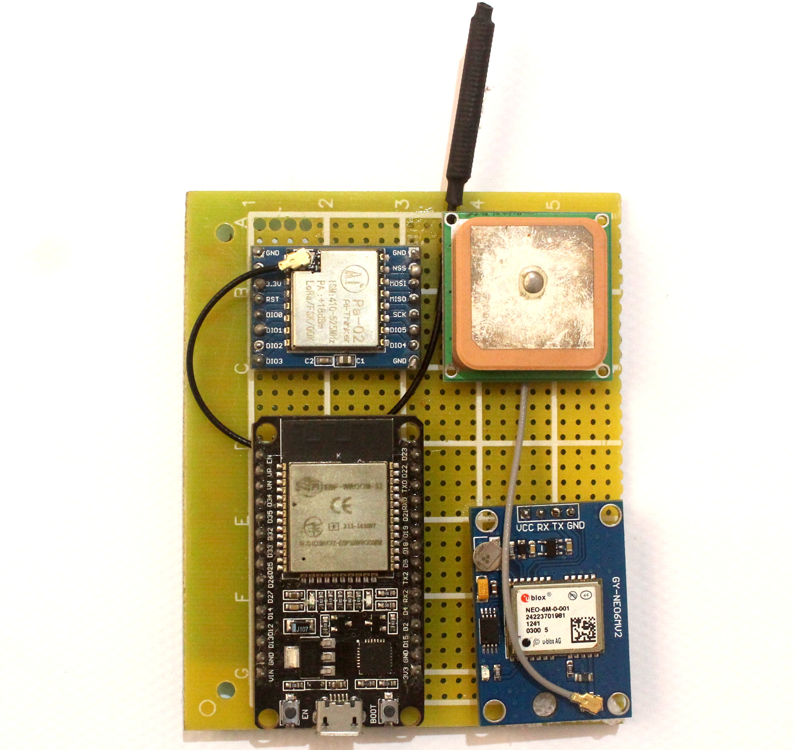
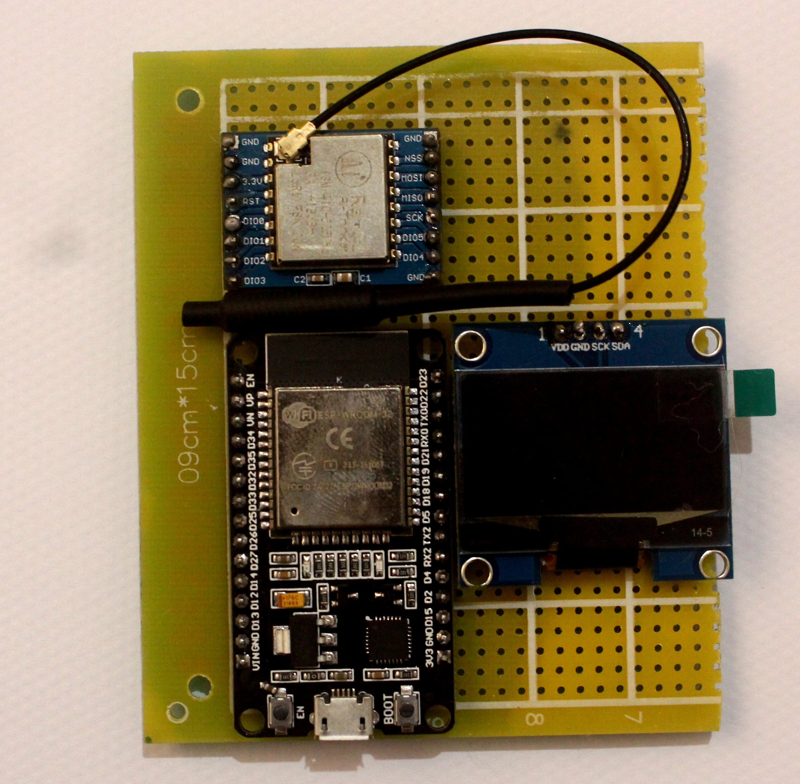

# 🛰️ ESP32 LoRa Geofencing Project 🚀

This project involves a geofencing system using ESP32 modules and LoRa RA02 modules operating at 433 MHz to track GPS coordinates and display them. The system is designed to monitor GPS data and can be extended to provide alerts if certain geofencing criteria are met.

## 🎯 How It Works

1. **GPS Transmission**: The GPS Transmitter Module uses an ESP32 and GPS module to transmit GPS coordinates via a LoRa RA02 module.
2. **Data Reception**: The Receiver Base Station uses another ESP32 with a LoRa RA02 module to receive the GPS coordinates.
3. **Display**: The Receiver Base Station displays the received GPS coordinates on an OLED screen.

## 🛠️ Technologies Used

- **ESP32 Development Boards**: For both GPS transmission and data reception.
- **LoRa RA02 Modules**: For long-range wireless communication.
- **GPS Module**: For capturing geographic coordinates.
- **OLED Display**: For displaying GPS coordinates.
- **Arduino IDE/PlatformIO**: For programming the ESP32 modules.

## 📷 System Architecture

The following diagram illustrates the architecture of the system:

               +-----------------------------+
               |     GPS Transmitter Module   |
               | (ESP32 + GPS Module + LoRa) |
               |   Transmits GPS coordinates  |
               +-----------------------------+
                           |
                           V
               +-----------------------------+
               |   Receiver Base Station     |
               | (ESP32 + LoRa + OLED Display)|
               | Receives and displays GPS   |
               | coordinates on OLED screen  |
               +-----------------------------+

## Project Components

1. **GPS Transmitter Module**
   - **Function:** Captures and transmits GPS coordinates.
   - **Endpoints:**
     - Not applicable (transmits data via LoRa).
   - **Controls:**
     - **Start Transmission:** Starts sending GPS data.
   - **Image Placeholder:**
     - 

2. **Receiver Base Station**
   - **Function:** Receives GPS data and displays it on an OLED screen.
   - **Endpoints:**
     - Not applicable (receives data via LoRa).
   - **Controls:**
     - **Display Coordinates:** Shows received GPS coordinates.
   - **Image Placeholder:**
     - 

## Setup Instructions
### Usage:
```bash
git clone https://github.com/iceman404/esp32_lora_geofencing.git
cd esp32_lora_geofencing/basic
idf.py menuconfig
idf.py -p /dev/tty* flash
idf.py -p /dev/tty* monitor
```

1. **GPS Transmitter Module Configuration:**
   - Update the Wi-Fi credentials in the code using idf.menuconfig and upload the code to the ESP32 via esp-idf.
   - Ensure the LoRa module is properly connected and configured and do pre-checks logs in serial monitor.

2. **Receiver Base Station Configuration:**
   - Update the Wi-Fi credentials in the code using idf.menuconfig and upload the code to the ESP32 via esp-idf.
   - Connect the OLED display to the ESP32 and ensure it is properly initialized, and perform pre-checks logs in the serial monitor.

## Controls

- **GPS Transmitter Module:**
  - Power on the module and ensure it is transmitting GPS data via LoRa. Monitor the serial output for connection status.

- **Receiver Base Station:**
  - Power on the module and verify that it is receiving GPS data and displaying it on the OLED screen. Check the serial output for connection status and any errors.

## Troubleshooting

- **Connections:** Double-check all hardware connections and configurations, including LoRa and OLED connections.

## License

This project is licensed under the MIT License - see the [LICENSE](LICENSE) file for details.

## Acknowledgments

- Special thanks to the developers of the ESP32 libraries and LoRa modules for making this project feasible.
